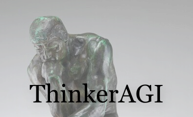

# ThinkerAGI
ThinkerAGI is a autogpt model based on the BabyAGI project. It is a self criticizing AI application that helps us answer philosophical problems. Hence, called the Thinker 

[![MIT License][license-shield]][license-url]

<!-- PROJECT LOGO -->
 

  

  <h3 align="center">ThinkerAGI</h3>

  

    A person who always thinks has nothing to think but thoughts.
     
    <a href="https://github.com/omkhairate/ThinkerAGI"><strong>Explore the docs »</strong></a>
     
     
    <a href="https://github.com/omkhairate/ThinkerAGI">View Demo</a>
    ·
    <a href="https://github.com/omkhairate/ThinkerAGI/issues">Report Bug</a>
    ·
    <a href="https://github.com/omkhairate/ThinkerAGI/issues">Request Feature</a>
  

<!-- TABLE OF CONTENTS -->

  
Table of Contents

  <ol>
    <li>
      <a href="#about-the-project">About The Project</a>
      <ul>
        <li><a href="#built-with">Built With</a></li>
      </ul>
    </li>
    <li>
      <a href="#getting-started">Getting Started</a>
      <ul>
        <li><a href="#prerequisites">Prerequisites</a></li>
        <li><a href="#installation">Installation</a></li>
      </ul>
    </li>
    <li><a href="#usage">Usage</a></li>
    <li><a href="#roadmap">Roadmap</a></li>
    <li><a href="#contributing">Contributing</a></li>
    <li><a href="#license">License</a></li>
    <li><a href="#contact">Contact</a></li>
    <li><a href="#acknowledgments">Acknowledgments</a></li>
  </ol>

<!-- ABOUT THE PROJECT -->
## About The Project

With the advent of ChatGPT, we are ever closer to the development of artificial general intelligence. This project is an attempt to give AI a philosophical thought process in order to ponder, crtiticize and come up with modern solutions to age old philosophical problems. 

Of course, this project is no where near complete but just a beginning in vast space of autogpt. For any features or suggestions please feel free to use the issues tab.

### Built With

This section should list any major frameworks/libraries used to bootstrap your project. Leave any add-ons/plugins for the acknowledgements section. Here are a few examples.

* LangChain
* FAISS
* OpenAI
* Pydantic

<!-- LICENSE -->
## License

Distributed under the MIT License. See `LICENSE.txt` for more information.

(<a href="#readme-top">back to top</a>)

<!-- CONTACT -->
## Contact

Om Khairate - [@daddysadhguru](https://twitter.com/daddysadhguru) - omkhairate@gmail.com

(<a href="#readme-top">back to top</a>)

